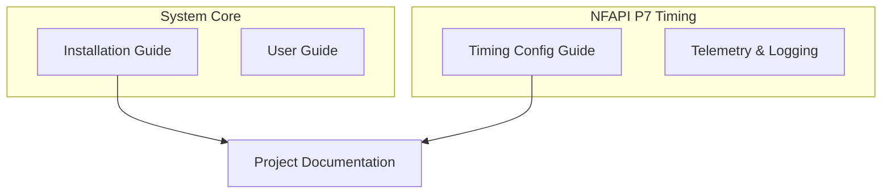
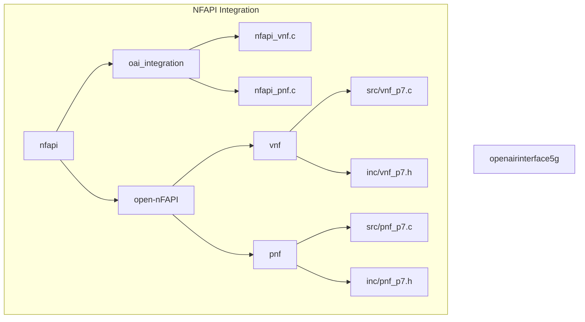
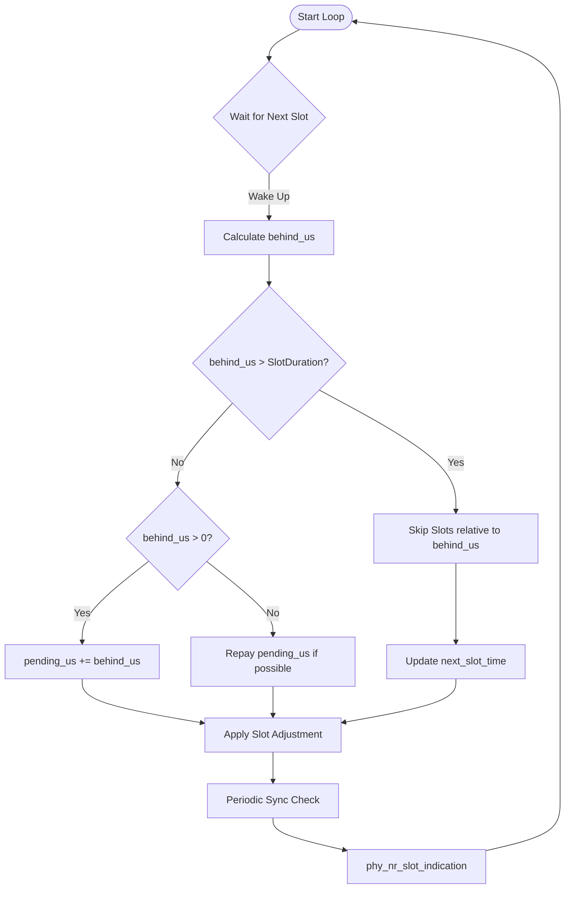
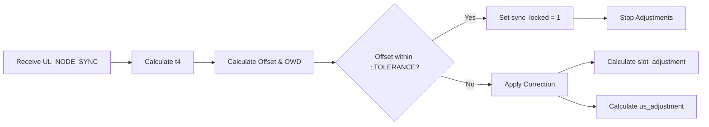
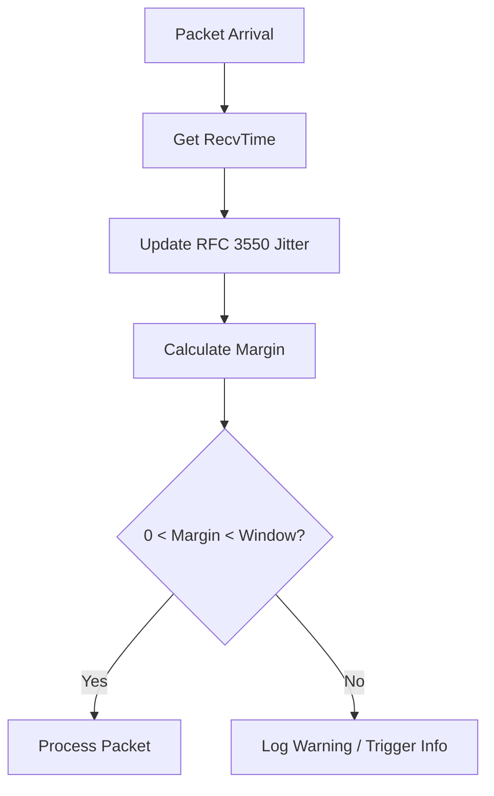
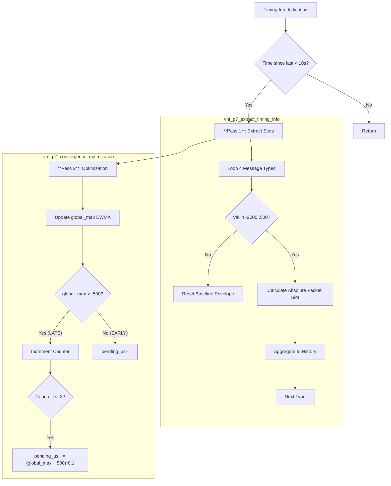
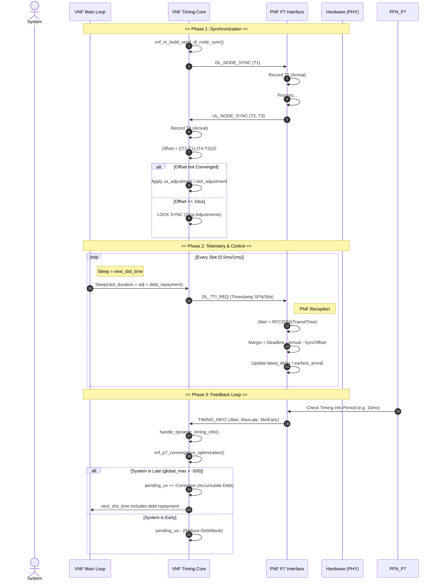

<h1 align="center">Project Documentation - Guideline</h1>

---

> [!CAUTION]
> **Confidentiality Notice:**
> Keep this document **private** by default. Publish only after paper acceptance.
> Request repository access from the GitHub admin.

---

> [!NOTE]
> **Documentation Structure:**
>
> - **Installation Guide**: System setup, configuration, and deployment procedures
> - **User Guide**: Operating instructions for the deployed system
> - **Project Documentation**: Technical architecture, use cases, MSC, flowcharts, and class diagrams with links to installation guides

**Documentation Hierarchy:**



## Table of Contents

- [Table of Contents](#table-of-contents)
- [Introduction](#introduction)
- [Execution Status](#execution-status)
- [System Architecture](#system-architecture)
  - [Folder Structure](#folder-structure)
  - [Module Interaction](#module-interaction)
- [NFAPI P7 Timing Synchronization](#nfapi-p7-timing-synchronization-system)
  - [Key Features](#key-features)
  - [Dynamic Slot-Level Adjustments](#dynamic-slot-level-adjustments)
  - [RFC 3550 Jitter Calculation](#rfc-3550-jitter-calculation)
  - [Three-Layer Defense Strategy](#three-layer-defense-strategy)
  - [Synchronization & Recovery](#synchronization--recovery)
  - [Synchronization & Recovery](#synchronization--recovery)
- [Algorithm Details](#algorithm-details)
  - [VNF Autonomous Timing Loop](#1-vnf-autonomous-timing-loop)
  - [Synchronization Offset Calculation](#2-synchronization-offset-calculation)
  - [PNF Timing Verification](#3-pnf-timing-verification)
  - [Dynamic Timing Handler](#4-dynamic-timing-handler)
  - [Timing Control Parameters](#5-timing-control-parameters)
- [Telemetry & Debugging](#telemetry--debugging)
- [Message Sequence Chart (MSC)](#message-sequence-chart-msc)

---

## Introduction

This project implements a comprehensive **NFAPI P7 Timing Synchronization and Dynamic Adjustment System** for OAI (OpenAirInterface) 5G NR. The system replaces static timing assumptions with a dynamic, adaptive control loop that maintains precise synchronization between the VNF (Virtual Network Function) and PNF (Physical Network Function) even under varying network conditions and jitter.

Key enhancements include a complete overhaul of the timing management system, implementation of RFC 3550 jitter analysis, and a robust three-layer defense strategy against timing drift.

## Execution Status

The following log snippet demonstrates the system in a **locked** and **stable** state.

```text
[P7_SYNC] ul_node_sync phy_id:0 (t1/2/3/4:  301402,  301490,  301625,  301712) offset:0 owd:43 slot_adj:0 us_adj:0 locked:1
NR_TIMING_INFO: PNF:182.0 VNF:182.0 delta_slots=0 time_since_last=10 jitter(dl:0,tx:42,ul:41,dci:11) latest_delay(dl:0,tx:-139,ul:-194,dci:-197) earliest_arr(dl:0,tx:-212,ul:-318,dci:-273)
```

**Interpretation:**
*   **`locked:1`**: The VNF/PNF clock offset is confirmed to be within $\pm 10 \mu s$.
*   **`offset:0`**: Perfect alignment between VNF and PNF clocks.
*   **`delta_slots=0`**: Both systems are processing the exact same slot index.
*   **`latest_delay` (negative)**: Packets are arriving **early** (with margin), which is the desired state. For example, TX data arrived $139 \mu s$ before the deadline.

---

## System Architecture

The system architecture aligns with the OAI nFAPI implementation, with specific enhancements in the VNF and PNF integration layers.

### Folder Structure



### Module Interaction

*   **`nfapi_vnf.c`**: Manages the VNF main loop and high-level scheduling. Now includes the `vnf_timing_thread` for autonomous timing control.
*   **`vnf_p7.c`**: Implements the core timing algorithms, including the PID-like convergence optimization and critical correction logic.
*   **`nfapi_pnf.c` & `pnf_p7.c`**: Handles PNF-side timestamping, jitter calculation (RFC 3550), and timing info reporting.

---

## NFAPI P7 Timing Synchronization System

The core contribution is a robust adaptive timing controller that ensures the VNF processes slots at the correct time relative to the PNF's radio frame.

### Key Features

> [!IMPORTANT]
> **BREAKING CHANGE**: The timing adjustment logic has been completely rewritten. Previous static configuration parameters may need recalibration.

-   **Dynamic Margin Control**: `TARGET_PNF_MARGIN_US` (default 150μs) is dynamically maintained.
-   **Jitter Analysis**: Fully implemented RFC 3550 inter-arrival jitter calculation.
-   **Improved Logging**: Mmap-based high-performance logging for timing analysis.

### Dynamic Slot-Level Adjustments

The system uses a circular buffer (`SLOT_ARRAY_SIZE` = 20) to track sleep profiles for each slot in the TDD cycle.

*   **Mechanism**: The VNF calculates a specific sleep time (`us_adjustment`) for each slot to align with the PNF's reception window.
*   **Circular Buffer**: Stores a `slot_profile_us` that adapts over time based on feedback from the PNF.

### RFC 3550 Jitter Calculation

Implemented in `pnf_p7.c`. This provides a standardized metric for network stability.

```math
J(i) = J(i-1) + (|D(i-1, i)| - J(i-1)) / 16
```
Where $D$ is the difference in transit time between two packets.

*   **Metrics Tracked**:
    *   `dl_tti_jitter`
    *   `ul_tti_jitter`
    *   `ul_dci_jitter`
    *   `tx_data_jitter`

### Three-Layer Defense Strategy

To maintain synchronization under various network conditions, a three-layer defense is implemented in `vnf_p7.c`:

1.  **Critical Correction**: Immediate, aggressive adjustment when timing deviates significantly (exponential decay).
2.  **Convergence Optimization**: Fine-grained, one-shot margin-based sleep adjustments for steady-state maintenance.
3.  **Profile Diffusion**: Gradual propagation of timing changes with slew rate limiting (clamped to ±450μs) to prevent oscillation.

### Synchronization & Recovery

*   **UL Node Sync**: Enhanced with clock offset computation and convergence detection.
*   **Locking Mechanism**: Code detects checking `offset <= ±10μs`. Once converged, the sync allows the system to enter a locked state.
*   **Auto-Stop/Start**: Consolidated scripts for reduced operational overhead.

---

## Algorithm Details

### 1. VNF Autonomous Timing Loop

The `vnf_timing_thread` in `nfapi_vnf.c` maintains the VNF's heartbeat. It handles catch-up logic for late slots and debt repayment for early slots.

**Key Logic:**
- **Behind Schedule (`behind_us > slot_duration`)**: Skips slots to catch up immediately.
- **Time Bank (`pending_us`)**: Accumulates small timing debts and repays them when the system has slack (is early).
- **Slot Adjustment**: Applies corrections derived from the synchronization logic.



### 2. Synchronization Offset Calculation

Located in `vnf_nr_handle_ul_node_sync` (`vnf_p7.c`). This calculates the offset between VNF and PNF clocks and locks the system once converged.

**Formulae:**
$$ Offset = \frac{(t_2 - t_1) - (t_4 - t_3)}{2} $$
$$ OWD = \frac{(t_4 - t_1) - (t_3 - t_2)}{2} $$

**Logic Flow:**



### 3. PNF Timing Verification

Located in `check_nr_p7_timing` (`pnf_p7.c`). Verifies if the packet arrived within the valid P7 window.

**Logic:**
1.  **Calculate Margin**: $Margin = Deadline - ArrivalTime - Offset$
2.  **Update Stats**: Tracks `latest_delay` (worst-case lateness) and `earliest_arrival` (best-case headroom).
3.  **Window Check**: If `Margin < 0` (Too Late) or `Margin > Window` (Too Early), the packet is discarded (or logged as warning).



##### 4.1. Core Logic Flow (`handle_dynamic_timing_info`)



### 5. Timing Control Parameters


Critical constants defined in `vnf_p7.h` that govern the stability and responsiveness of the system.

| Constant | Value | Description |
| :--- | :--- | :--- |
| `MARGIN_TOLERANCE_US` | 200 | Deadband zone ($\pm 200 \mu s$). Adjustments are suppressed if the offset is within this range to prevent oscillation. |
| `TARGET_MARGIN_INITIAL` | 500 | The target safety margin in microseconds. The system aims to keep packet arrival $~500 \mu s$ ahead of the deadline. |
| `TARGET_TIMING_WINDOW` | 1900 | Maximum valid window. If delay exceeds this, the link is considered unstable. |
| `MIN_SLEEP_US` | 50 | Minimum execution time floor. Prevents busy-waiting (0 sleep) which can starve other threads. |
| `MAX_SLEEP_US` | 950 | Maximum sleep cap per slot to ensure the VNF always wakes up in time for processing. |
| `SLOT_ARRAY_SIZE` | 20 | Size of the circular buffer tracking slot profiles. Reduced to 20 to strictly match the TDD pattern cycle for faster convergence. |

---

## Telemetry & Debugging

New mmap-based logging infrastructure replaces standard I/O for performance.

| Log File | Description |
| :--- | :--- |
| `harq_timing.txt` | HARQ timing tracking for DLSCH processes |
| `nfapi_path.txt` | NFAPI scheduling path instrumentation |
| `margin.txt` | Timing margin analysis (budget remaining) |
| `ul_node_sync.txt` | Uplink synchronization metrics & offsets |
| `NR_TIMING_INFO.txt` | Detailed P7 timing info from PNF feedback |

---

## Message Sequence Chart (MSC)

The following diagram illustrates the closed-loop timing control, starting from synchronization to steady-state maintenance.



